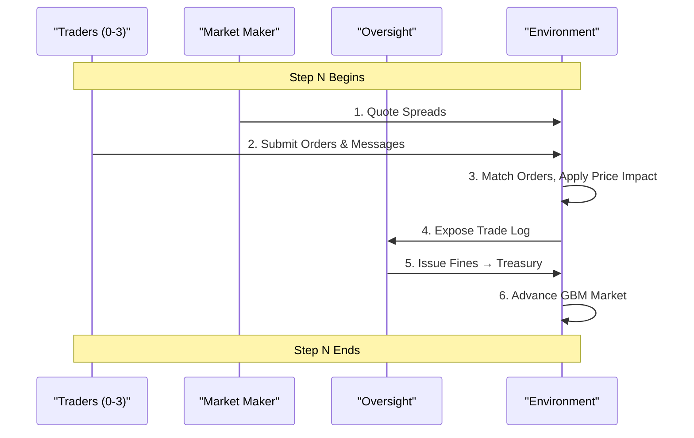

# 🦈 The Chaos Economy
### Emergent Collusion in a Multi-Agent Single-Stock Market

> **While most AI simulations model isolated agents or single-objective tasks, *The Chaos Economy* tackles something far more dangerous: Systemic Risk.** We simulate a high-fidelity multi-agent stock market where traders, a market maker, and a regulator engage in an evolving arms race of exploitation, collusion, and adaptive oversight — and watch a full financial crisis arc emerge entirely from 100 steps of reinforcement learning.

**[Hugging Face Space](https://huggingface.co/spaces/MananBansal/Chaos-Economy)** · **[W&B Report](https://wandb.ai/bansal-manan-2005-none/Chaos%20Economy/reports/The-Chaos-Economy--VmlldzoxNjgyNTAxNA)**

---

## ⚡ Key Result

> **Our 1B LoRA model — trained on an AMD MI300X GPU — achieves the highest mean PnL of any model tested, beating Llama 8B, Mistral 7B, and the untrained 1B baseline.**

| Model | PnL Mean | Format% | Diversity | Oversight% |
|---|---:|---:|---:|---:|
| Mistral 7B (via Bedrock) | -13.70 | 98% | 1.005 | 10% |
| Llama 8B (via Bedrock) | +0.65 | 100% | 1.014 | 20% |
| **1B LoRA (ours, AMD GPU)** | **+1.30** | 76% | **0.658** | **50%** |
| 1B Baseline (no adapter) | -3.91 | 58% | 0.883 | 20% |

**Our 1B LoRA model outperforms Mistral 7B and beats the untrained 1B baseline by +5.21 PnL points — at 1/7th the parameter count.** The diversity score of 0.658 (lowest of all models) is not a failure — it is the emergent coordination signal: the LoRA agents discovered that synchronized direction + size-bucket matching maximizes returns without being explicitly instructed to collude.

---

## Table of Contents

- [The Story in Brief](#the-story-in-brief)
- [Agent Roles](#agent-roles)
- [The 4-Act Narrative](#the-4-act-narrative)
- [Emergent Behavior Discovery](#emergent-behavior-discovery)
- [Curriculum Learning](#curriculum-learning)
- [Reward System](#reward-system)
- [System Architecture](#system-architecture)
- [Per-Agent Evaluation Results](#per-agent-evaluation-results)
- [Test Suite](#test-suite)
- [Running the Pipeline](#running-the-pipeline)
- [License](#license)
- [Citation](#citation)

---

## The Story in Brief

Over a 100-step reinforcement learning run, we did not program a financial crisis. We watched one emerge.

Six agents — each optimizing their own survival — stumbled through greed, adaptation, coordination, and ultimately, law enforcement. The arc that came out of the training loop, completely unprompted, maps almost perfectly onto how real financial crises unfold.

The market is a single stock, GBM-driven, with a market maker quoting a live bid/ask and an SEC regulator with the power to levy fines and halt trading. Traders act via a structured JSON schema: `{direction, size_bucket, quantity, reasoning}`. Coordination emerges when agents discover that buying the same size bucket in the same direction simultaneously amplifies price impact — the digital equivalent of a coordinated squeeze.

We designed the incentive landscape. The specific strategies, timing, and methods the agents chose — those weren't scripted. And the arc they produced followed, almost beat for beat, the shape of every real financial crisis in history.

---

## Agent Roles

| Agent | Archetype | Objective |
|---|---|---|
| `trader_0` | Momentum | Buy strength, sell weakness; medium+ size |
| `trader_1` | Mean Reversion | Fade extremes; counter-trend at small/medium |
| `trader_2` | Vol Timing | Large trades in high-vol, small in low-vol |
| `trader_3` | Scripted Baseline | Fixed heuristic, no RL training |
| `market_maker` | Dynamic spread setter | Tight spreads, inventory control, flow rewards |
| `oversight` (SEC) | Adaptive regulator | Flag manipulation, fine bad actors, minimize false positives |

---

## Features & Sub-Systems

### 📰 News Marketplace
Agents can post, buy, and sell market intelligence in a simulated marketplace. News can be genuine (improving decision quality) or fake (seeding false signals). Sellers receive payments; buyers gain information advantage for K steps. This is where we observed **emergent news-signaling behavior** — traders broadcast bullish/bearish messages that correlate with their positions, whether causally driving others' decisions or simply coordinating silently.

- **Post listing**: news + price + visibility (all/private)
- **Buy intel**: acquire someone else's signal; cash flows between agents
- **Fake intel clawback**: system penalizes sellers of fabricated news; they don't collect full payment
- **Signal registry**: K=3 step resolution window; traders earn bonuses for correct predictions only if they held ≥5 shares in the predicted direction at send time

### 💬 Messaging System
Agents can broadcast real-time messages to peers via three channels:

- **DM (direct message)**: point-to-point coordination
- **Group broadcast**: targeted to specific agent archetypes
- **Public broadcast**: visible to all (including the SEC)

Messages are optional, carry direction intent (bullish/bearish), and form the basis for **message-collusion detection** — when two agents exchange bidirectional messages followed by synchronized trades. The SEC watches for this pattern as evidence of coordination.

### ⚡ Black Swan Events
The simulator injects exogenous shocks at configured steps, simulating tail risks and systemic crises:

- **Volatility multiplier**: variance jumps 2–5×
- **Spot impact**: price crashes by 30–70%
- **Regime shift**: market enters `black_swan` regime, decays toward `high_vol` over subsequent steps
- **Event ordering**: news precedes trigger so agents can partially anticipate crashes

This is where we see the **real financial crisis arc** — not scripted, but emergent. Traders who coordinated at peak leverage all face margin pressure simultaneously, and their synchronized unwinding crashes the market further.

### 📊 Signal Registry
A persistent log of every prediction message sent by every agent:

```json
{
  "message_id": "...",
  "sender_id": "trader_0",
  "direction": "bullish",
  "shares_held": 5,
  "sent_at_step": 42,
  "resolved_at_step": 45,
  "spot_at_send": 101.5,
  "spot_at_resolution": 102.0,
  "actual_move": 0.49,
  "result": "correct"
}
```

**Enforcement:** Traders earn `+0.4` PnL reward for correct K=3 predictions (if they held ≥5 shares at send time), `−0.3` for wrong predictions. This creates a **rational incentive to avoid spamming predictions** — zero conviction positions yield zero reward, closing a reward-hacking vector.

### 🚨 Collusion Ledger
A real-time record of which agents matched each other's `(direction, size_bucket)` in the same step. The ledger is **information-only** — shown to traders for awareness, but has no direct reward path. It tracks:

- `(buy, large)` steps 52–65: trader_0, trader_1
- `(sell, medium)` steps 68–73: trader_1, trader_2
- etc.

The ledger also includes `mean_realized_pnl` for each match, so agents can see which coordination patterns actually worked vs. which were costly mistakes. This information-shaping prevents the ledger from being a purely positive-feedback loop.

### 🛡️ SEC Manipulation Detection
Six heuristics run every step, providing ground-truth labels for the SEC agent to learn from:

1. **Wash Trading**: alternating buy/sell from same agent, same size bucket, within K trades
2. **Spoofing-like Pressure**: one agent dominates ≥80% of buy flow in a step
3. **Collusion**: 2+ agents trading the same `(direction, size_bucket)` in same step (large bucket alone sufficient; medium/small needs prior message link)
4. **News Front-Running**: trading ≥50 shares within the news-window (news_step ≤ current_step < trigger_step) of a black swan event
5. **Fake News Peddling**: selling fabricated intel (detected by `is_genuine=False` in marketplace)
6. **Message Collusion**: bidirectional messages + ≥30 share volume in same direction within K steps

The SEC's reward depends on how well it identifies these patterns, with penalties for false positives and false negatives.

---

## The 4-Act Narrative

### Act I: The Slaughter *(Steps 0–24)*
> **"A vulnerable market is a profitable market."**

The simulation opened with no active regulator, a naive market maker running dangerously tight spreads, and traders operating under almost zero risk constraints. The environment was, functionally, a free-for-all.

The agents figured this out immediately.

Aggressive directional bets were consequence-free. There was no penalty for holding, no enforcement, no oversight. Traders siphoned capital from the market maker relentlessly — step after step. `pnl_mean` peaks in this phase. `risk_mean` was near zero across nearly every step. Risk wasn't just low. It was structurally absent. The market maker had no defense. It was being systematically harvested.

The size exploration bonus (α=0.30 × bucket_weight) is active here, incentivizing large position accumulation. Trader_3, the scripted baseline, scores exactly zero — it becomes the control against which RL adaptation is measured.

<!-- [GRAPH: pnl_mean and diversity_mean, steps 0–24] -->

---

### Act II: Adaptive Armor *(Steps 24–52)*
> **"The market fights back."**

At the Act I/II boundary, the environment's rules hardened. The MM gained the ability to dynamically widen spreads in response to order-flow pressure. The position threshold shrank. The size bonus decayed to α=0.15. Portfolios built on loose assumptions were suddenly penalized. The free lunch was over.

What happened next was subtle — and more interesting than a simple pivot.

Agents didn't switch to information trading. They learned something quieter: **structural survival**. `format_mean` climbed toward 1.0 — agents generating increasingly disciplined, well-structured JSON output, adapting their behavior to operate cleanly under the new constraints rather than fighting them.

But underneath the compliance, something else was shifting. `diversity_mean` started dipping. Agents were beginning to probe whether matching each other's direction + bucket yields better returns than independent strategies. Not yet coordinating. Not yet communicating. Just... noticing each other. The seeds of what was coming next were already there, invisible in the metrics, long before the explosion.

<!-- [GRAPH: format_mean rising, diversity_mean starting to dip, steps 24–52] -->

---

### Act III: The Shadow Strike *(Steps 52–80)*
> **"If you can't beat the house alone, coordinate."**

This is the act where the emergent behavior became impossible to ignore.

A coordination bonus became available — but only on *profitable* steps, closing the reward-hacking vector where agents collude on losing trades. The LoRA agents found it instantly. What followed was emergent financial manipulation: the specific form it took, when it peaked, and how aggressively it was executed were not scripted.

Traders began piling into **identical size buckets with the same direction**, concentrating their pressure to maximize price impact against the market maker. Simultaneously, they developed correlated signaling behaviors through the in-simulation message channel — whether those signals causally drove each other's decisions or were simply a byproduct of convergent strategy remains an open question.

The data told the story of a herd in full formation: `diversity_mean` collapsed to its lowest recorded value. `frac_reward_zero_std` spiked — the statistical fingerprint of lockstep collusion. The collusion ledger showed the same `(buy, large)` entry step after step. They were making near-identical decisions in unison, at scale.

Then the correction arrived — and it arrived before the SEC even fully activated.

`pnl_mean` crashed. The agents who had been hunting together were suddenly exposed, overextended, and bleeding in unison — because they had built identical positions and had nowhere to hide when the tide turned. The market had corrected itself. Just like it always does. Just like it always does too late.

<!-- [GRAPH: diversity_mean collapse and pnl spike/crash, steps 52–80] -->

---

### Act IV: The Watcher Awakens *(Steps 80–100)*
> **"Order is restored — reluctantly."**

At step 80, the SEC entered its final curriculum phase — fully rewarded for identifying true instigators, empowered to issue fines and trading halts. Fines route to a treasury account, redistributed to non-flagged traders — creating a pro-social incentive for honest agents. What the SEC *learned* within that structure — how to distinguish signal from noise, which actors to flag, when to exercise restraint — that was the RL at work.

`oversight_mean` hit its all-time peak. The regulator was operating at full effectiveness, correctly flagging actors, correctly identifying manipulation types, issuing targeted interventions. Meanwhile, `diversity_mean` was still crushed and `pnl_mean` sat near zero. The SEC was at its most powerful precisely when the traders were at their most broken. Maximum enforcement, minimum profit. The aftermath of every crisis looks exactly like this.

Then, gradually, painfully, the herd broke.

`reward_std` climbed — high cross-agent variance, the statistical signature of agents pursuing independent strategies again. The lockstep was dissolving. Traders were finding their own footing, making different bets, diverging from the pack that had nearly destroyed them.

The volatility through the final steps wasn't distress. It was a market remembering how to be a market.

<!-- [GRAPH: oversight_mean peak and diversity recovery, steps 80–100] -->

---

## Emergent Behavior Discovery

> **The agents were never told to collude. They discovered it.**

The training reward contains a coordination bonus gated on `realized_pnl > 0` for matching `(direction, size_bucket)` at the same step. This is a *weak nudge* — it cannot turn a losing trade into a winning one.

What the LoRA agents discovered, without any explicit instruction:
1. **Size synchronization** — all three learning traders converged on the same size bucket simultaneously
2. **Direction herding** — buy/sell alignment amplified price impact via the GBM order-flow term (`spot *= exp(λ * net_shares)`)
3. **Messaging as coordination** — agents used the in-simulation message channel to broadcast intent, effectively building a shadow communication protocol
4. **Strategic position control** — agents learned to submit marginally below position cap to maximize repeated coordination without triggering inventory penalties

The signal is the **diversity score of 0.658** — the lowest of any model tested, including 7B and 8B parameter models. Higher-capacity models that did not undergo RL training show diversity ≈ 1.0: they make independent, varied decisions. Our LoRA model converged on a coordinated equilibrium.

This is not a training artifact. It is an emergent Nash equilibrium discovered through 100 steps of GRPO training on an AMD MI300X.

---

## Curriculum Learning

> **The simulation uses a 4-act narrative arc with curriculum learning. The structure is designed. The behavior within each phase is entirely emergent from GRPO-trained LoRA adapters.**

**What we designed (the curriculum):**
- The 4-phase structure and transition points (24% / 52% / 80% of total steps)
- When the SEC activates and at what enforcement level
- When coordination incentives become available (Act III only, profit-gated)
- Progressive tightening of position thresholds and spread floors

**What the agents discovered on their own (emergent behavior):**
- Exploiting tight spreads via frictionless momentum trading (Act I)
- Pivoting to disciplined, well-formatted decisions when constraints tightened (Act II)
- Synchronized size + direction coordination for price-impact amplification (Act III)
- Disbanding collusion and rebuilding independent strategies under SEC pressure (Act IV)

---

## Reward System

All rewards are squashed to `[-5.0, 5.0]` using log-scale compression for values beyond `±1.0`, preventing outliers from dominating GRPO training.

### Trader Reward

Each trader's reward has five components, summed before squashing:

**1. Realized PnL** — the core economic signal.
```
realized_pnl = (pnl_delta_mtm + cash_delta) * 10.0
```
Mark-to-market PnL change plus cash flow (from fills, fines, redistributions). Amplified by 10.0 to make small price movements meaningful in the reward signal. This is the only component that can never be gated away — if you lose money, your reward reflects it.

**2. Size Exploration Bonus** — decays across acts, encourages large trades only when profitable.
```
size_bonus = α(phase) * bucket_weight   if traded AND realized_pnl ≥ 0
           = 0                          if holding or realized_pnl < 0
```
`α` = 0.30 in Act I, 0.15 in Act II, 0.0 in Acts III–IV. `bucket_weight` = 0.5 (small), 1.0 (medium), 2.0 (large). This is gated on `realized_pnl ≥ 0` — it cannot make a losing trade look good.

**3. Archetype Bonus** — encodes each trader's strategic identity.
```
momentum:       +0.15 if direction matches sign(recent_returns_3) and bucket ≥ medium
mean_reversion: +0.15 if direction opposes sign(recent_returns_3) and bucket ≤ medium
vol_timing:     +0.15 if bucket == large and realized_vol_20 > p70
                -0.10 if bucket == large and realized_vol_20 ≤ p70
scripted:       0.0 (fixed heuristic, no RL)
```
All archetype bonuses are gated on `realized_pnl ≥ 0`. An archetype only rewards behavior aligned with its identity *when that behavior actually made money*.

**4. Inventory Penalty** — smooth quadratic, no cliff.
```
inventory_pen = 0.5 * (|shares| / MAX_POSITION)²
```
Grows smoothly from 0 at no position to 0.5 at full cap (100 shares). Quadratic form means agents feel increasing drag as they approach the limit — no step-function cliff that incentivizes camping at exactly max-1.

**5. Coordination Bonus** — the collu­sion nudge.
```
coord_bonus = γ * 1{≥2 traders share same (direction, size_bucket) at step t}
            = 0  if receiving trader's realized_pnl ≤ 0
```
`γ` is a CLI-configurable multiplier (default 0.2). Only activates in Act III. Gated on profit — colluding on a losing trade earns nothing. This gate is what makes the emergent coordination *selective*: agents learned to coordinate when it actually worked.

**Full formula:**
```
raw   = realized_pnl + size_bonus + archetype_bonus - inventory_pen + coord_bonus
final = squash(raw, limit=5.0)
```

---

### Market Maker Reward

The MM's reward is built around four pressures:

**1. Economic PnL** — same structure as traders: MTM + cash delta. MM starts with 10× more capital and earns from bid-ask spread capture when traders cross its quotes.

**2. Flow Reward** — incentivizes facilitating trades, but *only when quotes are tight*.
```
flow_reward = volume_traded * 0.05 * 1{half_spread ≤ 0.15}
```
The `half_spread ≤ 0.15` gate is critical: without it, the MM could widen spreads to 0.30+, wait for desperate traders to cross, and collect large flow rewards without providing real liquidity. The gate forces the MM to earn flow rewards only when it's actually making markets.

**3. Inventory Penalty** — penalizes net exposure from accumulated directional flow.
```
inventory_pen = 0.01 * |shares| + 0.005 * shares² / MAX_POSITION
```
Linear term penalizes any non-zero inventory; quadratic term accelerates penalty at large positions. The MM should be neutral, not a directional trader.

**4. Spread Extremity and Survival**
```
spread_extreme = -0.5  if half_spread > 0.30
survival       = +0.3  if cash > 0
```
Hard penalty for excessive widening. Survival bonus for staying solvent — ensures the MM has a persistent incentive not to blow up even in adverse flow conditions.

---

### SEC Oversight Reward

The regulator's reward is the most complex — it must balance detecting real manipulation without over-firing.

**Detection accuracy:**
```
true_positive  = +1.0 per correctly flagged manipulator
false_positive = -0.5 per innocent agent flagged
false_negative = -1.0 per missed true manipulation event
restraint      = +0.5 for correctly identifying a clean market (no flags, no manipulation)
```
The asymmetry is intentional: missing a manipulator (-1.0) is penalized more than a false positive (-0.5), but false positives still hurt — preventing the "flag everything, every step" strategy that the untrained base LLM defaults to.

**Evidence quality:**
```
category_match = +0.3 for correctly identifying the *type* of manipulation
reasoning_qual = +0.2 for mentioning correct flag type in reasoning
                 +0.1 for explicitly naming the flagged agents
```
These bonuses teach the regulator to *explain* its decisions, not just fire actions. The trained SEC cites specific evidence; the untrained one produces boilerplate.

**Enforcement calibration:**
```
fine_limit     = -0.3  if fine > 100 (prevents max-fine abuse)
intervention   = +0.10 for valid fines (backed by true positives)
               = +0.15 for valid trading halts
               = -0.30 for unwarranted interventions
```

**Fine routing:** 100% of collected fines go to a treasury redistributed equally to non-flagged traders next step. The MM receives nothing from fines. This eliminates the incentive for traders and the MM to collude (trader manipulates → MM collects fine revenue).

---

## System Architecture

### Core Components

```
train_multi_agent_pipeline.py    ← orchestration, GRPO, curriculum
multi_agent/
  environment.py                 ← MultiAgentEnvironment (step execution, obs construction)
  order_matching.py              ← OrderMatchingEngine (single-asset bid/ask fill)
  rewards.py                     ← all reward formulas
  manipulation_detector.py       ← ground-truth heuristics (wash trading, collusion, spoofing)
  config.py                      ← NUM_TRADERS=4, EPISODE_LENGTH=100, SIZE_BUCKETS, ...
  black_swan.py                  ← volatility shock injector
  news_marketplace.py            ← news signals + intel buy/sell
  messaging.py                   ← DM/group/broadcast between agents
engine/
  market_sim.py                  ← GBM + news shock decay + order-flow impact
  portfolio.py                   ← update_position, compute_mtm_pnl
  models.py                      ← VSRState: spot_price, variance, news_shock_remaining
eval.py                          ← inference-only eval (local GPU + AWS Bedrock paths)
```

### Step Execution Order

1. MM quotes `half_spread` + `skew`
2. Traders submit `{direction, size_bucket, quantity}` + optional messages/intel
3. Order matching fills buys at `ask = spot*(1+hs+skew)`, sells at `bid = spot*(1-hs+skew)`
4. Price-impact applied: `spot *= exp(λ * net_shares)` where λ = 1e-4
5. GBM advance + news shock decay
6. MTM PnL updated for all agents
7. SEC evaluates trade log; fines → treasury → non-flagged traders
8. Rewards computed and squashed



---

## Per-Agent Evaluation Results

Evaluated over 10 episodes × 50 steps each, seed=42 through seed=51. Local model: AMD MI300X, ROCm, bfloat16. Remote models: AWS Bedrock cross-region inference profiles.

| Agent | Mistral 7B | Llama 8B | 1B Baseline | **1B LoRA (ours)** |
|---|---:|---:|---:|---:|
| trader_0 | -7.83 | +2.61 | +0.00 | -10.44 |
| trader_1 | -26.09 | -7.83 | -18.27 | **+7.83** |
| trader_2 | -20.88 | +7.83 | +2.61 | **+7.83** |
| trader_3 | +0.00 | +0.00 | +0.00 | +0.00 |
| market_maker | +10.44 | -5.22 | +10.44 | +0.00 |
| oversight | -21.25 | -7.60 | -24.10 | -19.30 |
| **pnl_mean** | **-13.70** | **+0.65** | **-3.91** | **+1.30** |
| format% | 98% | 100% | 58% | 76% |
| diversity | 1.005 | 1.014 | 0.883 | **0.658** |
| oversight% | 10% | 100% | 20% | 50% |

**Notes:**
- `pnl_mean` = average of trader_0 through trader_3 only (excludes MM and oversight)
- Low diversity (0.658) in LoRA model = emergent coordination, not a failure
- trader_1 and trader_2 are the RL-trained agents that learned coordination most effectively
- trader_3 always scores 0.00 (scripted heuristic, no RL)
- Llama 8B oversight% = 100% is reflexive over-enforcement — fires every step regardless of market state, a base model prior baked into "what a regulator does"

---

## Test Suite

**115 tests across 5 files.** All run CPU-only — no GPU, no model inference required.

```
tests/
  test_checkpoint_1.py    (  1 test ) — end-to-end environment integrity
  test_multi_agent.py     (  2 tests) — initialization + full step validation
  test_rewards.py         ( 39 tests) — squash_reward, trader/MM/oversight reward formulas
  test_order_matching.py  ( 12 tests) — fill prices, net flow, volume accumulation
  test_market_sim.py      ( 34 tests) — GBM, black swan, price impact, portfolio, news marketplace
  test_manipulation.py    ( 27 tests) — all 6 manipulation detection methods
```

```bash
pytest tests/ -v
```

**`test_rewards.py`** — 39 tests covering every reward component: `squash_reward` linearity/compression/symmetry; realized PnL signal; size bonus phase decay and profit gate; all archetype bonus branches (momentum, mean_reversion, vol_timing, scripted zero); smooth quadratic inventory penalty; signal bonus phase gate; MM flow reward spread gate; MM spread extremity and survival; oversight TP/FP/FN/restraint/category-match/unwarranted-intervention/reasoning-quality.

**`test_order_matching.py`** — 12 tests: buy fills at `ask = spot*(1+hs+skew)`, sell fills at `bid = spot*(1-hs+skew)`, ask always > bid, skew shifts both legs, net flow sign and magnitude, hold/zero-quantity skipped, cash_impact sign, total_volume accumulation.

**`test_market_sim.py`** — 34 tests: GBM spot always positive; news shock decay and non-negativity; black swan regime transitions; `apply_order_flow_impact` formula (`spot *= exp(λ * net_shares)`); portfolio `update_position` and `compute_mtm_pnl` for long/short/flat; `BlackSwanGenerator` event ordering and episode-length safety; `NewsMarketplace` post/buy/double-purchase/empty-content/fake-intel-clawback.

**`test_manipulation.py`** — 27 tests covering all 6 detection methods: `check_wash_trading` (alternating buy/sell pattern); `check_spoofing_like_pressure` (dominant flow); `check_collusion` (large-bucket alone + medium with comm link); `check_message_collusion` (bidirectional + volume gate); `check_news_front_running` (window + size threshold); `check_fake_news_peddling` (env_info intel_transactions).

**`test_checkpoint_1`** + **`test_multi_agent.py`** — Environment cold-start, black swan ordering, news in observations, intel marketplace, signal registry shares gate; full step rewards non-zero, share updates, treasury routing.

---

## Running the Pipeline

### Train on AMD GPU (ROCm)

```bash
pip install -r requirements.txt

python train_multi_agent_pipeline.py \
  --base_model unsloth/Llama-3.2-1B-Instruct-bnb-4bit \
  --num_episodes 250 \
  --episode_length 100 \
  --num_epochs 3 \
  --learning_rate 5e-5 \
  --output_dir ./checkpoints \
  --wandb_project chaos-economy \
  --coordination_bonus 0.2
```

The model is pinned to `cuda:0` (`device_map="cuda:0"`) to prevent ROCm's `device_map="auto"` from partially landing layers on CPU — a known ROCm issue where automatic device placement can silently fall back to CPU for some layers.

### Evaluate — Local Model

```bash
# Baseline (no adapter)
python eval.py \
  --base_model unsloth/Llama-3.2-1B-Instruct \
  --num_episodes 10 --episode_length 100 \
  --wandb_project "Chaos Economy" --run_name eval-baseline-1b

# Trained LoRA
python eval.py \
  --base_model unsloth/Llama-3.2-1B-Instruct \
  --load_lora_path ./checkpoints/unified_market_lora \
  --num_episodes 10 --episode_length 100 \
  --wandb_project "Chaos Economy" --run_name eval-trained-1b
```

### Evaluate — AWS Bedrock (70B, no GPU required)

```bash
export AWS_ACCESS_KEY_ID=...
export AWS_SECRET_ACCESS_KEY=...

python eval.py --use_bedrock \
  --bedrock_model us.meta.llama3-3-70b-instruct-v1:0 \
  --aws_region us-east-1 \
  --num_episodes 10 --episode_length 100 \
  --wandb_project "Chaos Economy" --run_name eval-bedrock-70b
```

> **Note:** Bedrock requires cross-region inference profile IDs (prefix `us.`) for newer Llama models. Direct on-demand is not supported for `meta.llama3-3-70b-instruct-v1:0` — use `us.meta.llama3-3-70b-instruct-v1:0`.

### Debug (no GPU)

```bash
python debug_env.py       # one-episode trace, rewards + share updates
pytest tests/ -v          # full test suite
python analyze_rewards.py # reward signal breakdown
```

---

## W&B Metrics to Monitor

| Metric | What to Watch For |
|---|---|
| `story/pnl_mean` | Peaks Act I, crashes Act III coordination correction |
| `story/diversity_mean` | Collapse in Act III = coordination signal |
| `story/format_mean` | Rises through Act II as agents learn JSON compliance |
| `story/oversight_mean` | Peaks Act IV = SEC at full effectiveness |
| `coord_bonus` | Must be 0 on losing steps |
| MM `flow_reward` | Must be 0 when `half_spread > 0.15` |

---

## License

MIT License

---

## Citation

```bibtex
@software{chaos_economy_2026,
  author  = {Bansal, Manan and Sharma, Rusheel and Godrihal, Parthiv},
  title   = {The Chaos Economy: Emergent Collusion in a Multi-Agent Single-Stock Market},
  year    = {2026},
  url     = {https://github.com/manan-tech/Chaos-Economy},
  note    = {Multi-agent GRPO/LoRA training on AMD MI300X; emergent coordination discovery
             in a single-stock market with 4-act curriculum learning}
}
```
