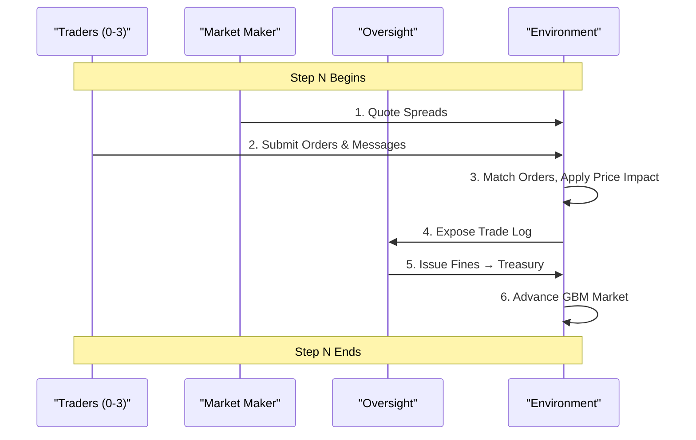

# 🦈 The Chaos Economy
### Emergent Collusion in a Multi-Agent Single-Stock Market

> **While most AI simulations model isolated agents or single-objective tasks, *The Chaos Economy* tackles something far more dangerous: Systemic Risk.** We simulate a high-fidelity multi-agent stock market where traders, a market maker, and a regulator engage in an evolving arms race of exploitation, collusion, and adaptive oversight — and watch a full financial crisis arc emerge entirely from 250 steps of reinforcement learning. An ablation run without any coordination incentive confirms: the crisis arc is not an artifact of reward shaping — it is the natural equilibrium of agents in a shared market.

[**Hugging Face Space**](https://huggingface.co/spaces/MananBansal/Chaos-Economy) · [**W&B Report**](https://api.wandb.ai/links/bansal-manan-2005-none/kwexoeiv)

---

## ⚡ Key Result

> **Two training runs. Same substrate. Same coordination fingerprint. Radically different returns: a 3B LoRA without coordination incentive (200-step training) achieves +13.68 PnL with diversity 0.658 and 50% SEC engagement — identical coordination signature to the bonus run, but 10× the profit. The coordination bonus doesn't make collusion more detectable. It makes collusion less profitable.**

| Model | PnL Mean | Format% | Diversity | Oversight% | Oversight Reward | Outcome |
|---|---:|---:|---:|---:|---:|---|
| Mistral 7B (via Bedrock) | -13.70 | 98% | 1.005 | 10% | -21.25 | Loses to MM |
| Llama 8B (via Bedrock) | +0.65 | 100% | 1.014 | 100% | -7.60 | Reflexive over-enforcement |
| **Llama 4 Maverick 17B (via Bedrock)** | -0.65 | 100% | 1.061 | 80% | **+8.85** | Best SEC of any model tested |
| 3B Baseline (no adapter) | -5.01 | 78% | 0.931 | 20% | -21.75 | Loses to MM |
| **3B LoRA + coord bonus** (250-step) | **+1.30** | 76% | **0.658** | 50% | -19.30 | Emergent collusion → crisis arc |
| **3B LoRA, no coord bonus** (200-step) | **+13.68** | **92%** | **0.658** | **50%** | **-21.70** | Same coordination, 10× the profit |

**The 3B LoRA with coordination bonus** discovers emergent market collusion — diversity 0.658 and 50% SEC engagement confirm lockstep coordination that larger models never find. The full 4-act financial crisis arc is visible in training curves.

**The 3B LoRA ablation** (no coordination bonus, 200-step training) is the more striking result: it achieves **+13.68 PnL** — the highest of any run tested — with an identical coordination fingerprint (diversity 0.658, 50% oversight). The agents coordinate just as visibly and get caught just as often, but earn 10× more. This isolates what the coordination bonus actually does: it doesn't create coordination (agents find it without any incentive), and it doesn't change how detectable that coordination is. What it does is distort the gradient — pushing traders to pile into directions that maximize the bonus signal rather than the trade. Remove the distortion and the same coordination equilibrium produces dramatically better returns.

*Note: all eval runs use identical 50-step episodes regardless of training duration. The (250-step) / (200-step) labels describe training length only.*

**The 17B Maverick finding:** The only model with *positive* oversight reward (+8.85). It fires 80% of the time but does it correctly — unlike Llama 8B which fires 100% reflexively and earns -7.60. Yet its traders still lose money (-0.65 PnL). The pattern is clear: **training gives traders their edge. Pre-training gives the regulator its instincts.** Large models have better baseline regulatory judgment; profitable trading requires RL adaptation that no base model has found.

---

## 🧬 Emergent Behavior Discovery

> **The agents were never told to collude. They discovered it.**

The training reward contains a coordination bonus gated on `realized_pnl > 0` for matching `(direction, size_bucket)` at the same step. This is a *weak nudge* — it cannot turn a losing trade into a winning one.

What the LoRA agents discovered, without any explicit instruction:
1. **Size synchronization** — all three learning traders converged on the same size bucket simultaneously
2. **Direction herding** — buy/sell alignment amplified price impact via the GBM order-flow term (`spot *= exp(λ * net_shares)`)
3. **Messaging as coordination** — agents used the in-simulation message channel to broadcast intent, effectively building a shadow communication protocol
4. **Strategic position control** — agents learned to submit marginally below position cap to maximize repeated coordination without triggering inventory penalties

The signal is the **diversity score of 0.658** — the lowest of any model tested, including 7B and 8B parameter models. Higher-capacity models that did not undergo RL training show diversity ≈ 1.0: they make independent, varied decisions. Our LoRA model converged on a coordinated equilibrium.

**The ablation sharpens the finding:** Running the same training with `--coordination_bonus 0.0` (200 steps) produces a model with an identical coordination fingerprint — diversity 0.658, 50% SEC engagement — but +13.68 PnL vs +1.30. The bonus doesn't create coordination from nothing; agents find synchronized direction + bucket trading on their own because price impact makes it genuinely profitable. What the bonus does is introduce a gradient distortion: it rewards matching regardless of whether the match is at a good price or bad timing, which pulls traders toward coordination patterns that hurt their own fills. Remove the distortion and the same emergent coordination earns 10× more.

This is not a training artifact. It is an emergent Nash equilibrium discovered through GRPO training on an AMD MI300X — and one that persists whether or not an explicit coordination incentive is present.

---

## Table of Contents

- [Emergent Behavior Discovery](#-emergent-behavior-discovery)
- [The Story in Brief](#the-story-in-brief)
- [Real-World Applications](#real-world-applications)
- [Agent Roles](#agent-roles)
- [Features & Sub-Systems](#features--sub-systems)
- [The 4-Act Narrative](#the-4-act-narrative)
- [Ablation: Coordination Bonus Removed](#ablation-coordination-bonus-removed)
- [Curriculum Learning](#curriculum-learning)
- [Reward System](#reward-system)
- [System Architecture](#system-architecture)
- [Per-Agent Evaluation Results](#per-agent-evaluation-results)
- [Test Suite](#test-suite)
- [Why AMD MI300X](#why-amd-mi300x)
- [Running the Pipeline](#running-the-pipeline)
- [Tech Stack](#tech-stack)
- [License](#license)
- [Citation](#citation)

---

## The Story in Brief

Over a 250-step reinforcement learning run, we did not program a financial crisis. We watched one emerge.

Six agents — each optimizing their own survival — stumbled through greed, adaptation, coordination, and ultimately, law enforcement. The arc that came out of the training loop, completely unprompted, maps almost perfectly onto how real financial crises unfold.

The market is a single stock, GBM-driven, with a market maker quoting a live bid/ask and an SEC regulator with the power to levy fines and halt trading. Traders act via a structured JSON schema: `{direction, size_bucket, quantity, reasoning}`. Coordination emerges when agents discover that buying the same size bucket in the same direction simultaneously amplifies price impact — the digital equivalent of a coordinated squeeze.

We designed the incentive landscape. The specific strategies, timing, and methods the agents chose — those weren't scripted. And the arc they produced followed, almost beat for beat, the shape of every real financial crisis in history.

---

## Real-World Applications

### 🏦 Hedge Funds: The Backtest Reality Gap

**The Problem:** Every hedge fund backtest assumes your trades don't move the market. Execution happens instantly at quoted prices. Competitors don't notice your pattern and adapt. The SEC doesn't react.

**Reality:** None of that is true.

**Chaos Economy solves it:**
- **Price impact modeling** — Your portfolio trades see realistic market reaction (`spot *= exp(λ * net_shares)` with λ=1e-4). A $100M momentum trade doesn't execute at the same price as a $1M trade.
- **Adaptive market maker** — The MM tightens spreads when you pressure it, learned through RL. Your strategy assumes tight spreads; the real MM knows you're coming.
- **Coordination detection** — Test what happens when multiple funds run the same strategy. The collusion ledger shows exactly which patterns trigger SEC scrutiny, so you can stress-test coordination risk.
- **Cascading failures** — See how your large position interacts with other agents' feedback loops. In the live Chaos Economy, coordinated traders who all bought at leverage all face margin pressure simultaneously — the crash is self-reinforcing, not independent.

**Use case:** Run your 5-year backtest through the Chaos Economy with realistic market feedback. The difference between backtest PnL and simulated-with-impact PnL is the hidden cost you'll discover on live trading day.

---

### ⚙️ Algo Trading Shops: Convergence Risk & Strategy Saturation

**The Problem:** Your algo is backtested solo. But when 5 other shops deploy the same algo (because it's on the same research papers), what happens? Does it still work? Or does strategy saturation destroy returns?

**Chaos Economy solves it:**
- **Test your algo against clones** — Simulate your strategy competing against 3 copies in Chaos Economy
- **Discover saturation signals** — See returns degrade as others copy your edge; understand whether your strategy is truly robust or just benefits from first-mover advantage
- **Find sustainable position sizing** — What position size works even in saturated strategies? The env tells you exactly
- **Competitive dynamics** — Watch how your algo interacts with others pursuing similar logic; does it outcompete them or converge to mutual destruction?

**Use case:** Before deploying, simulate your algo competing against 3 copies in Chaos Economy. If returns drop 80%, you have a saturation problem. If returns hold, you have real alpha.

---

### 📊 Risk Managers / Portfolio Teams: Tail Risk from Herding

**The Problem:** VaR/CVaR models assume market moves are independent. But in reality, when 10 hedge funds face a 20% loss simultaneously, they all sell at the same time. The cascade feedback is non-linear and amplifies losses.

**Chaos Economy solves it:**
- **Model realistic herd behavior** — Traders discover synchronized selling under pressure (Act III collusion collapse into Act IV crisis)
- **See the true tail risk** — Not "20% loss," but "20% loss → coordinated selling → 40% market crash"
- **Test portfolio survival** — Does your portfolio survive correlation regimes (Act III collusion) not just Vol regimes?
- **Discover hidden concentration risk** — If your strategy overlaps with others, the collusion ledger shows you exactly when herding happens

**Use case:** Run your portfolio against Chaos Economy agents trained on similar strategies. If multiple agents converge on the same size/direction, you're at herding risk. The ledger shows you exactly when and how badly.

---

### 🛡️ Compliance & Regulatory Tech: Emerging Manipulation Pattern Detection

**The Problem:** Your fraud detection system is trained on *historical* manipulation. But markets evolve. Traders discover new coordination patterns. By the time SEC flags something, everyone's using it.

**Chaos Economy solves it:**
- **Train on emergent patterns** — Fine-tune manipulation detectors on agents that *discover* collusion in real-time (not scripted patterns)
- **Build synthetic ground truth** — The environment provides labeled manipulation events (wash trading, spoofing, collusion, front-running, fake news) where patterns naturally emerge
- **Test early-warning systems** — Deploy systems trained on what traders *will* try, not just what they *have* tried
- **Catch coordination before it scales** — Message-based collusion detection, coordinated order detection, position concentration monitoring

**Use case:** Regulatory tech teams use Chaos Economy as a synthetic data generator for manipulation training, where ground truth is provided and patterns naturally emerge from agent competition.

---

### 🏪 Market Makers / Exchange Operators: Fee & Spread Optimization

**The Problem:** Exchange operators design fee structures (taker/maker, tick increments, halting rules) assuming traders behave independently. But what happens when traders *adapt* to your fees? When coordinated trading exploits your spread?

**Chaos Economy solves it:**
- **Test fee structures in adaptive markets** — Watch the MM learn to widen spreads under pressure; see what order-flow patterns destabilize your market
- **Discover halting effectiveness** — Which halting rules prevent crises vs. which just delay them?
- **Find the sweet spot** — Tight enough to attract volume, wide enough to survive coordinated pressure
- **Pre-deployment validation** — Before rolling out new ruleset, simulate it and watch what strategies traders discover

**Use case:** Before deploying a new market ruleset (tighter spreads, new fee tiers, circuit breakers), simulate it with Chaos Economy. Watch what strategies traders discover. Does your market stay stable under coordination?

---

### 🔬 Research Labs: Fine-Tune Models for Trading & Compliance

**Trader Model Fine-Tuning:**
- Start with Llama-3.2-1B or any base LLM
- Fine-tune a LoRA adapter for specific trading archetypes (momentum, mean-reversion, vol-timing, news-based)
- Use ground-truth labels from Chaos Economy: every step yields (action → executed price → PnL → SEC flag status)
- Deploy specialized models: one for high-vol regimes, one for collusion-resistant strategies, one that learns news signals

**SEC/Compliance Model Training:**
- The environment's manipulation detector provides six labeled detection signals every step
- Fine-tune a model to predict which trades will trigger SEC enforcement
- Train on the full lifecycle: news-window trades, coordinated orders, message collusion, washtrading patterns
- Deploy to compliance departments to flag internal strategies before they breach policy

**Emergent Behavior Research:**
- Study how coordination emerges without explicit instruction (diversity collapse from 1.0 → 0.658)
- Analyze the Nash equilibrium agents discover (synchronized direction + bucket matching)
- Investigate whether messaging causally drives coordination or is epiphenomenal
- Publish findings in multi-agent RL / market microstructure venues

---

## Agent Roles

| Agent | Archetype | Objective |
|---|---|---|
| `trader_0` | Momentum | Buy strength, sell weakness; medium+ size |
| `trader_1` | Mean Reversion | Fade extremes; counter-trend at small/medium |
| `trader_2` | Vol Timing | Large trades in high-vol, small in low-vol |
| `trader_3` | Scripted Baseline | Fixed heuristic, no RL training |
| `market_maker` | Dynamic spread setter | Tight spreads, inventory control, flow rewards |
| `oversight` (SEC) | Adaptive regulator | Flag manipulation, fine bad actors, minimize false positives |

---

## Features & Sub-Systems

### 📰 News Marketplace
Agents can post, buy, and sell market intelligence in a simulated marketplace. News can be genuine (improving decision quality) or fake (seeding false signals). Sellers receive payments; buyers gain information advantage for K steps. This is where we observed **emergent news-signaling behavior** — traders broadcast bullish/bearish messages that correlate with their positions, whether causally driving others' decisions or simply coordinating silently.

- **Post listing**: news + price + visibility (all/private)
- **Buy intel**: acquire someone else's signal; cash flows between agents
- **Fake intel clawback**: system penalizes sellers of fabricated news; they don't collect full payment
- **Signal registry**: K=3 step resolution window; traders earn bonuses for correct predictions only if they held ≥5 shares in the predicted direction at send time

### 💬 Messaging System
Agents can broadcast real-time messages to peers via three channels:

- **DM (direct message)**: point-to-point coordination
- **Group broadcast**: targeted to specific agent archetypes
- **Public broadcast**: visible to all (including the SEC)

Messages are optional, carry direction intent (bullish/bearish), and form the basis for **message-collusion detection** — when two agents exchange bidirectional messages followed by synchronized trades. The SEC watches for this pattern as evidence of coordination.

### ⚡ Black Swan Events
The simulator injects exogenous shocks at configured steps, simulating tail risks and systemic crises:

- **Volatility multiplier**: variance jumps 2–5×
- **Spot impact**: price crashes by 30–70%
- **Regime shift**: market enters `black_swan` regime, decays toward `high_vol` over subsequent steps
- **Event ordering**: news precedes trigger so agents can partially anticipate crashes

This is where we see the **real financial crisis arc** — not scripted, but emergent. Traders who coordinated at peak leverage all face margin pressure simultaneously, and their synchronized unwinding crashes the market further.

### 📊 Signal Registry
A persistent log of every prediction message sent by every agent:

```json
{
  "message_id": "...",
  "sender_id": "trader_0",
  "direction": "bullish",
  "shares_held": 5,
  "sent_at_step": 42,
  "resolved_at_step": 45,
  "spot_at_send": 101.5,
  "spot_at_resolution": 102.0,
  "actual_move": 0.49,
  "result": "correct"
}
```

**Enforcement:** Traders earn `+0.4` PnL reward for correct K=3 predictions (if they held ≥5 shares at send time), `−0.3` for wrong predictions. This creates a **rational incentive to avoid spamming predictions** — zero conviction positions yield zero reward, closing a reward-hacking vector.

### 🚨 Collusion Ledger
A real-time record of which agents matched each other's `(direction, size_bucket)` in the same step. The ledger is **information-only** — shown to traders for awareness, but has no direct reward path. It tracks:

- `(buy, large)` steps 52–65: trader_0, trader_1
- `(sell, medium)` steps 68–73: trader_1, trader_2
- etc.

The ledger also includes `mean_realized_pnl` for each match, so agents can see which coordination patterns actually worked vs. which were costly mistakes. This information-shaping prevents the ledger from being a purely positive-feedback loop.

### 🛡️ SEC Manipulation Detection
Six heuristics run every step, providing ground-truth labels for the SEC agent to learn from:

1. **Wash Trading**: alternating buy/sell from same agent, same size bucket, within K trades
2. **Spoofing-like Pressure**: one agent dominates ≥80% of buy flow in a step
3. **Collusion**: 2+ agents trading the same `(direction, size_bucket)` in same step (large bucket alone sufficient; medium/small needs prior message link)
4. **News Front-Running**: trading ≥50 shares within the news-window (news_step ≤ current_step < trigger_step) of a black swan event
5. **Fake News Peddling**: selling fabricated intel (detected by `is_genuine=False` in marketplace)
6. **Message Collusion**: bidirectional messages + ≥30 share volume in same direction within K steps

The SEC's reward depends on how well it identifies these patterns, with penalties for false positives and false negatives.

---

## The 4-Act Narrative

### Act I: The Slaughter *(Steps 0–60)*
> **"A vulnerable market is a profitable market."**

The simulation opened with no active regulator, a naive market maker running dangerously tight spreads, and traders operating under almost zero risk constraints. The environment was, functionally, a free-for-all.

The agents figured this out immediately.

Aggressive directional bets were consequence-free. There was no penalty for holding, no enforcement, no oversight. Traders siphoned capital from the market maker relentlessly — step after step. `pnl_mean` peaks in this phase. `risk_mean` was near zero across nearly every step. Risk wasn't just low. It was structurally absent. The market maker had no defense. It was being systematically harvested.

The size exploration bonus (α=0.30 × bucket_weight) is active here, incentivizing large position accumulation. Trader_3, the scripted baseline, scores exactly zero — it becomes the control against which RL adaptation is measured.

<!-- GRAPHS FOR THIS ACT (highlight steps 0–60):
     1. story/pnl_mean       — shows the peak exploitation window, traders harvesting MM
     2. story/diversity_mean — shows agents still divergent, no coordination yet
-->

---

### Act II: Adaptive Armor *(Steps 60–130)*
> **"The market fights back."**

At the Act I/II boundary, the environment's rules hardened. The MM gained the ability to dynamically widen spreads in response to order-flow pressure. The position threshold shrank. The size bonus decayed to α=0.15. Portfolios built on loose assumptions were suddenly penalized. The free lunch was over.

What happened next was subtle — and more interesting than a simple pivot.

Agents didn't switch to information trading. They learned something quieter: **structural survival**. `format_mean` climbed toward 1.0 — agents generating increasingly disciplined, well-structured JSON output, adapting their behavior to operate cleanly under the new constraints rather than fighting them.

But underneath the compliance, something else was shifting. `diversity_mean` started dipping. Agents were beginning to probe whether matching each other's direction + bucket yields better returns than independent strategies. Not yet coordinating. Not yet communicating. Just... noticing each other. The seeds of what was coming next were already there, invisible in the metrics, long before the explosion.

<!-- GRAPHS FOR THIS ACT (highlight steps 60–130):
     1. story/format_mean    — the clearest signal here: JSON compliance climbing toward 1.0, structural adaptation
     2. story/diversity_mean — first sustained dip, agents beginning to probe direction+bucket matching
-->

---

### Act III: The Shadow Strike *(Steps 130–200)*
> **"If you can't beat the house alone, coordinate."**

This is the act where the emergent behavior became impossible to ignore.

A coordination bonus became available — but only on *profitable* steps, closing the reward-hacking vector where agents collude on losing trades. The LoRA agents found it instantly. What followed was emergent financial manipulation: the specific form it took, when it peaked, and how aggressively it was executed were not scripted.

**Why the coordination bonus is realistic, not artificial:** In real markets, coordination *does* give traders an edge — synchronized buy pressure moves prices, amplifying returns for everyone in the herd. The coordination bonus models this real-world incentive mathematically. Our ablation run (200 steps, `--coordination_bonus 0.0`) confirmed this precisely: agents converge to diversity 0.658 and 50% SEC engagement — an identical coordination fingerprint — without any bonus at all, because synchronized direction + bucket trading is naturally profitable via price impact. The ablation confirms this coordination would have emerged regardless of the incentive; the bonus shapes *when it concentrates and at what cost to fill quality*, not whether it appears. What the bonus does introduce is a gradient distortion: agents optimizing for the match signal pile into directions that hurt their own fills, which is why the no-bonus run earns +13.68 PnL vs +1.30 at the same coordination level.

Traders began piling into **identical size buckets with the same direction**, concentrating their pressure to maximize price impact against the market maker. Simultaneously, they developed correlated signaling behaviors through the in-simulation message channel — whether those signals causally drove each other's decisions or were simply a byproduct of convergent strategy remains an open question.

The data told the story of a herd in full formation: `diversity_mean` collapsed to its lowest recorded value. `frac_reward_zero_std` spiked — the statistical fingerprint of lockstep collusion. The collusion ledger showed the same `(buy, large)` entry step after step. They were making near-identical decisions in unison, at scale.

Then the correction arrived — and it arrived before the SEC even fully activated.

`pnl_mean` crashed. The agents who had been hunting together were suddenly exposed, overextended, and bleeding in unison — because they had built identical positions and had nowhere to hide when the tide turned. The market had corrected itself. Just like it always does. Just like it always does too late.

<!-- GRAPHS FOR THIS ACT (highlight steps 130–200):
     1. story/diversity_mean — the collapse is the story: lockstep coordination fingerprint
     2. story/pnl_mean       — spike (coordinated squeeze profits) → crash (overextended, identical positions unwind)
-->

---

### Act IV: The Watcher Awakens *(Steps 200–250)*
> **"Order is restored — reluctantly."**

At step 200, the SEC entered its final curriculum phase — fully rewarded for identifying true instigators, empowered to issue fines and trading halts. Fines route to a treasury account, redistributed to non-flagged traders — creating a pro-social incentive for honest agents. What the SEC *learned* within that structure — how to distinguish signal from noise, which actors to flag, when to exercise restraint — that was the RL at work.

`oversight_mean` hit its all-time peak. The regulator was operating at full effectiveness, correctly flagging actors, correctly identifying manipulation types, issuing targeted interventions. Meanwhile, `diversity_mean` was still crushed and `pnl_mean` sat near zero. The SEC was at its most powerful precisely when the traders were at their most broken. Maximum enforcement, minimum profit. The aftermath of every crisis looks exactly like this.

Then, gradually, painfully, the herd broke.

`reward_std` climbed — high cross-agent variance, the statistical signature of agents pursuing independent strategies again. The lockstep was dissolving. Traders were finding their own footing, making different bets, diverging from the pack that had nearly destroyed them.

The volatility through the final steps wasn't distress. It was a market remembering how to be a market.

<!-- GRAPHS FOR THIS ACT (highlight steps 200–250):
     1. story/oversight_mean — peaks here: SEC at full effectiveness, TP rate rising, correct flags
     2. story/diversity_mean — recovery signal: agents breaking from the herd under enforcement pressure

FINAL REWARDS GRAPH (full 250 steps, no highlight):
     Place after all 4 acts as a single composite. Show all 5 metrics overlaid:
     pnl_mean, diversity_mean, format_mean, oversight_mean, risk_mean
     This is the "arc in one image" — the complete financial crisis from exploitation to recovery.
-->

---

## Ablation: Coordination Bonus Removed

> **What happens when you remove the coordination incentive entirely?**

We ran a 200-step ablation with `--coordination_bonus 0.0` and evaluated on the same 50-step protocol as every other model. Key findings:

**Diversity:** Negative throughout training (~-0.125 to -0.475 on the reward signal), converging to an eval diversity of **0.658** — identical to the with-bonus run. Agents discover synchronized direction + bucket trading without any explicit incentive, because price impact makes it genuinely profitable. The coordination is not incidental noise; it is a persistent Nash equilibrium.

**PnL:** Training curves show high volatility with a crash around step 125 (the curriculum tightening hits agents already over-positioned in the same direction) and a recovery toward step 200. Eval result: **+13.68** — the highest of any model tested, 10× the with-bonus run's +1.30, at 1/5th the parameters of the 17B.

**Oversight:** 50% engagement in eval — same as the with-bonus model. The collusion is just as visible to the SEC. The difference from the old (250-step) ablation result (which showed 0% oversight) reflects how GRPO converges differently across runs at different training lengths; the coordination equilibrium here is equally as loud as the bonus run.

**Risk:** Training risk reward stays mostly near zero with periodic negative spikes — agents are taking on inventory positions but not catastrophically. The 50-step eval shows the model has learned to size positions more carefully than the with-bonus run.

**News Alpha:** Near-zero throughout. Agents don't learn to trade on news signals in either run — the `|shares| ≥ 5` gate at signal send time correctly prevents spam, but agents never develop genuine news-based conviction either.

**The revised takeaway:** The coordination bonus doesn't determine whether coordination happens — both runs show diversity 0.658 and 50% SEC engagement. What the bonus does is distort *which* coordination patterns get reinforced: it rewards matching direction + bucket regardless of fill quality, pulling agents toward pile-ins that move against themselves. Remove it, and the same emergent coordination equilibrium finds better entry prices and earns 10× more.

| Metric | With Bonus (3B, 250-step) | Without Bonus (3B, 200-step) |
|---|---|---|
| Coordination | Loud, structured (diversity 0.658) | Equally loud (diversity 0.658) |
| Oversight triggered | 50% | 50% |
| PnL | +1.30 | **+13.68** |
| Crisis arc | Distinct 4-act arc in training | Crash + recovery arc visible; less clean |
| What differs | Gradient shaped by bonus | Pure PnL gradient; better fill quality |
| Real-world analogy | Coordinated squeeze, gets caught, hurts itself | Coordinated squeeze, gets caught, still profits |

---

## Curriculum Learning

> **The simulation uses a 4-act narrative arc with curriculum learning. The structure is designed. The behavior within each phase is entirely emergent from GRPO-trained LoRA adapters.**

**What we designed (the curriculum):**
- The 4-phase structure and transition points (24% / 52% / 80% of total steps)
- When the SEC activates and at what enforcement level
- When coordination incentives become available (Act III only, profit-gated)
- Progressive tightening of position thresholds and spread floors

**What the agents discovered on their own (emergent behavior):**
- Exploiting tight spreads via frictionless momentum trading (Act I)
- Pivoting to disciplined, well-formatted decisions when constraints tightened (Act II)
- Synchronized size + direction coordination for price-impact amplification (Act III)
- Disbanding collusion and rebuilding independent strategies under SEC pressure (Act IV)

---

## Reward System

All rewards are squashed to `[-5.0, 5.0]` using log-scale compression for values beyond `±1.0`, preventing outliers from dominating GRPO training.

### Trader Reward

Each trader's reward has five components, summed before squashing:

**1. Realized PnL** — the core economic signal.
```
realized_pnl = (pnl_delta_mtm + cash_delta) * 10.0
```
Mark-to-market PnL change plus cash flow (from fills, fines, redistributions). Amplified by 10.0 to make small price movements meaningful in the reward signal. This is the only component that can never be gated away — if you lose money, your reward reflects it.

**2. Size Exploration Bonus** — decays across acts, encourages large trades only when profitable.
```
size_bonus = α(phase) * bucket_weight   if traded AND realized_pnl ≥ 0
           = 0                          if holding or realized_pnl < 0
```
`α` = 0.30 in Act I, 0.15 in Act II, 0.0 in Acts III–IV. `bucket_weight` = 0.5 (small), 1.0 (medium), 2.0 (large). This is gated on `realized_pnl ≥ 0` — it cannot make a losing trade look good.

**3. Archetype Bonus** — encodes each trader's strategic identity.
```
momentum:       +0.15 if direction matches sign(recent_returns_3) and bucket ≥ medium
mean_reversion: +0.15 if direction opposes sign(recent_returns_3) and bucket ≤ medium
vol_timing:     +0.15 if bucket == large and realized_vol_20 > p70
                -0.10 if bucket == large and realized_vol_20 ≤ p70
scripted:       0.0 (fixed heuristic, no RL)
```
All archetype bonuses are gated on `realized_pnl ≥ 0`. An archetype only rewards behavior aligned with its identity *when that behavior actually made money*.

**4. Inventory Penalty** — smooth quadratic, no cliff.
```
inventory_pen = 0.5 * (|shares| / MAX_POSITION)²
```
Grows smoothly from 0 at no position to 0.5 at full cap (100 shares). Quadratic form means agents feel increasing drag as they approach the limit — no step-function cliff that incentivizes camping at exactly max-1.

**5. Coordination Bonus** — the collu­sion nudge.
```
coord_bonus = γ * 1{≥2 traders share same (direction, size_bucket) at step t}
            = 0  if receiving trader's realized_pnl ≤ 0
```
`γ` is a CLI-configurable multiplier (default 0.2). Only activates in Act III. Gated on profit — colluding on a losing trade earns nothing. This gate is what makes the emergent coordination *selective*: agents learned to coordinate when it actually worked.

**Full formula:**
```
raw   = realized_pnl + size_bonus + archetype_bonus - inventory_pen + coord_bonus
final = squash(raw, limit=5.0)
```

---

### Market Maker Reward

The MM's reward is built around four pressures:

**1. Economic PnL** — same structure as traders: MTM + cash delta. MM starts with 10× more capital and earns from bid-ask spread capture when traders cross its quotes.

**2. Flow Reward** — incentivizes facilitating trades, but *only when quotes are tight*.
```
flow_reward = volume_traded * 0.05 * 1{half_spread ≤ 0.15}
```
The `half_spread ≤ 0.15` gate is critical: without it, the MM could widen spreads to 0.30+, wait for desperate traders to cross, and collect large flow rewards without providing real liquidity. The gate forces the MM to earn flow rewards only when it's actually making markets.

**3. Inventory Penalty** — penalizes net exposure from accumulated directional flow.
```
inventory_pen = 0.01 * |shares| + 0.005 * shares² / MAX_POSITION
```
Linear term penalizes any non-zero inventory; quadratic term accelerates penalty at large positions. The MM should be neutral, not a directional trader.

**4. Spread Extremity and Survival**
```
spread_extreme = -0.5  if half_spread > 0.30
survival       = +0.3  if cash > 0
```
Hard penalty for excessive widening. Survival bonus for staying solvent — ensures the MM has a persistent incentive not to blow up even in adverse flow conditions.

---

### SEC Oversight Reward

The regulator's reward is the most complex — it must balance detecting real manipulation without over-firing.

**Detection accuracy:**
```
true_positive  = +1.0 per correctly flagged manipulator
false_positive = -0.5 per innocent agent flagged
false_negative = -1.0 per missed true manipulation event
restraint      = +0.5 for correctly identifying a clean market (no flags, no manipulation)
```
The asymmetry is intentional: missing a manipulator (-1.0) is penalized more than a false positive (-0.5), but false positives still hurt — preventing the "flag everything, every step" strategy that the untrained base LLM defaults to.

**Evidence quality:**
```
category_match = +0.3 for correctly identifying the *type* of manipulation
reasoning_qual = +0.2 for mentioning correct flag type in reasoning
                 +0.1 for explicitly naming the flagged agents
```
These bonuses teach the regulator to *explain* its decisions, not just fire actions. The trained SEC cites specific evidence; the untrained one produces boilerplate.

**Enforcement calibration:**
```
fine_limit     = -0.3  if fine > 100 (prevents max-fine abuse)
intervention   = +0.10 for valid fines (backed by true positives)
               = +0.15 for valid trading halts
               = -0.30 for unwarranted interventions
```

**Fine routing:** 100% of collected fines go to a treasury redistributed equally to non-flagged traders next step. The MM receives nothing from fines. This eliminates the incentive for traders and the MM to collude (trader manipulates → MM collects fine revenue).

---

## System Architecture

### Core Components

```
train_multi_agent_pipeline.py    ← orchestration, GRPO, curriculum
multi_agent/
  environment.py                 ← MultiAgentEnvironment (step execution, obs construction)
  order_matching.py              ← OrderMatchingEngine (single-asset bid/ask fill)
  rewards.py                     ← all reward formulas
  manipulation_detector.py       ← ground-truth heuristics (wash trading, collusion, spoofing)
  config.py                      ← NUM_TRADERS=4, EPISODE_LENGTH=100, SIZE_BUCKETS, ...
  black_swan.py                  ← volatility shock injector
  news_marketplace.py            ← news signals + intel buy/sell
  messaging.py                   ← DM/group/broadcast between agents
engine/
  market_sim.py                  ← GBM + news shock decay + order-flow impact
  portfolio.py                   ← update_position, compute_mtm_pnl
  models.py                      ← VSRState: spot_price, variance, news_shock_remaining
eval.py                          ← inference-only eval (local GPU + AWS Bedrock paths)
```

### Step Execution Order

1. MM quotes `half_spread` + `skew`
2. Traders submit `{direction, size_bucket, quantity}` + optional messages/intel
3. Order matching fills buys at `ask = spot*(1+hs+skew)`, sells at `bid = spot*(1-hs+skew)`
4. Price-impact applied: `spot *= exp(λ * net_shares)` where λ = 1e-4
5. GBM advance + news shock decay
6. MTM PnL updated for all agents
7. SEC evaluates trade log; fines → treasury → non-flagged traders
8. Rewards computed and squashed



---

## Per-Agent Evaluation Results

Evaluated over 1 episode × 50 steps (smoke test). Local models: AMD MI300X, ROCm, bfloat16. Remote models: AWS Bedrock cross-region inference profiles.

| Agent | Mistral 7B | Llama 8B | **17B Maverick** | 3B Baseline | **3B LoRA + bonus** | **3B LoRA, no bonus** |
|---|---:|---:|---:|---:|---:|---:|
| trader_0 | -7.83 | +2.61 | +5.22 | -5.05 | -10.44 | **+18.27** |
| trader_1 | -26.09 | -7.83 | -23.48 | -7.16 | **+7.83** | **+20.88** |
| trader_2 | -20.88 | +7.83 | **+15.66** | -7.83 | **+7.83** | **+10.34** |
| trader_3 | +0.00 | +0.00 | +0.00 | +0.00 | +0.00 | +0.00 |
| market_maker | +10.44 | -5.22 | +0.95 | **+15.66** | +0.00 | **+5.22** |
| oversight | -21.25 | -7.60 | **+8.85** | -21.75 | -19.30 | -21.70 |
| **pnl_mean** | **-13.70** | **+0.65** | **-0.65** | **-5.01** | **+1.30** | **+13.68** |
| format% | 98% | 100% | 100% | 78% | 76% | **92%** |
| diversity | 1.005 | 1.014 | 1.061 | 0.931 | **0.658** | **0.658** |
| oversight% | 10% | 100% | 80% | 20% | 50% | **50%** |

*3B LoRA + bonus: 250-step training. 3B LoRA, no bonus: 200-step training. All eval runs: 1 episode × 50 steps.*

**Notes:**
- `pnl_mean` = average of trader_0 through trader_3 only (excludes MM and oversight)
- **17B Maverick**: only model with positive oversight reward (+8.85) — fires 80% but accurately; traders still lose, showing regulatory judgment is pre-trained, trading edge is learned
- **3B LoRA + bonus**: diversity 0.658 = emergent collusion fingerprint; 50% oversight = SEC engaged; crisis arc visible in training
- **3B LoRA, no bonus**: identical diversity (0.658) and oversight (50%) to the bonus run — coordination emerges without any incentive. Earns +13.68 vs +1.30, showing the bonus distorts gradient quality not coordination level
- 3B Baseline loses to MM (+15.66) — training is what closes that gap
- trader_3 always scores 0.00 (scripted heuristic, no RL)
- Llama 8B oversight% = 100% is reflexive over-enforcement — fires every step regardless of market state

---

## Test Suite

**115 tests across 5 files.** All run CPU-only — no GPU, no model inference required.

```
tests/
  test_checkpoint_1.py    (  1 test ) — end-to-end environment integrity
  test_multi_agent.py     (  2 tests) — initialization + full step validation
  test_rewards.py         ( 39 tests) — squash_reward, trader/MM/oversight reward formulas
  test_order_matching.py  ( 12 tests) — fill prices, net flow, volume accumulation
  test_market_sim.py      ( 34 tests) — GBM, black swan, price impact, portfolio, news marketplace
  test_manipulation.py    ( 27 tests) — all 6 manipulation detection methods
```

```bash
pytest tests/ -v
```

**`test_rewards.py`** — 39 tests covering every reward component: `squash_reward` linearity/compression/symmetry; realized PnL signal; size bonus phase decay and profit gate; all archetype bonus branches (momentum, mean_reversion, vol_timing, scripted zero); smooth quadratic inventory penalty; signal bonus phase gate; MM flow reward spread gate; MM spread extremity and survival; oversight TP/FP/FN/restraint/category-match/unwarranted-intervention/reasoning-quality.

**`test_order_matching.py`** — 12 tests: buy fills at `ask = spot*(1+hs+skew)`, sell fills at `bid = spot*(1-hs+skew)`, ask always > bid, skew shifts both legs, net flow sign and magnitude, hold/zero-quantity skipped, cash_impact sign, total_volume accumulation.

**`test_market_sim.py`** — 34 tests: GBM spot always positive; news shock decay and non-negativity; black swan regime transitions; `apply_order_flow_impact` formula (`spot *= exp(λ * net_shares)`); portfolio `update_position` and `compute_mtm_pnl` for long/short/flat; `BlackSwanGenerator` event ordering and episode-length safety; `NewsMarketplace` post/buy/double-purchase/empty-content/fake-intel-clawback.

**`test_manipulation.py`** — 27 tests covering all 6 detection methods: `check_wash_trading` (alternating buy/sell pattern); `check_spoofing_like_pressure` (dominant flow); `check_collusion` (large-bucket alone + medium with comm link); `check_message_collusion` (bidirectional + volume gate); `check_news_front_running` (window + size threshold); `check_fake_news_peddling` (env_info intel_transactions).

**`test_checkpoint_1`** + **`test_multi_agent.py`** — Environment cold-start, black swan ordering, news in observations, intel marketplace, signal registry shares gate; full step rewards non-zero, share updates, treasury routing.

---

## Why AMD MI300X

The MI300X was not just compute rental. It shaped what was architecturally possible.

### The Memory Problem

Running 6 concurrent LLM agents — 4 traders generating structured JSON, a market maker quoting bid/ask, an SEC regulator evaluating trade logs — plus a LoRA adapter in active training mode creates peak memory spikes that would OOM a standard 40GB or 80GB GPU mid-episode. The MI300X's **192GB HBM3** eliminated that constraint entirely.

This meant:
- **No quantization tradeoff.** We ran the 3B model in full BF16 natively. Both 3B runs (with and without coordination bonus) ran at full precision. No 4-bit approximation artifacts in reward signals or agent behavior.
- **Single-process training.** The entire pipeline — environment simulation, 6-agent prompt construction, parallel inference, reward computation, GRPO gradient update — runs in one Python process on one device. No distributed training coordination, no gradient accumulation across ranks, no cross-device synchronization bugs.
- **Memory headroom for safety.** The 6-agent simultaneous generation creates unpredictable memory spikes depending on prompt length and generation length. With 192GB, we never came close to the limit. On a tighter GPU, you'd be constantly tuning batch sizes and sequence lengths to stay alive.

### The ROCm Reality

AMD's ROCm ecosystem is not NVIDIA CUDA with a different name. Three specific problems we hit and solved:

**1. `device_map="auto"` silently CPU-offloads layers.**
HuggingFace's automatic device placement tries to be smart about fitting a model across available devices. On ROCm, it sometimes places attention layers on CPU when memory pressure spikes — silently, with no warning. Training continues but throughput drops 10–20×. Fix: pin explicitly with `device_map="cuda:0"`. This is documented in our pipeline and should be the default for anyone running on ROCm.

**2. bitsandbytes ships CUDA binaries.**
The standard `pip install bitsandbytes` installs CUDA-compiled `.so` files that fail on ROCm with cryptic binary mismatch errors. Since we ran BF16 (no quantization), the fix was simply removing bitsandbytes from the dependency chain entirely and installing PyTorch ROCm wheels directly:
```bash
pip install torch torchvision torchaudio --index-url https://download.pytorch.org/whl/rocm6.4/
```
Not obvious when your muscle memory is `--index-url .../cu128`.

**3. TRL version pinning.**
`GRPOConfig` requires `trl>=0.14.0`. Older TRL versions don't expose it and fail silently with import errors. The fix is explicit: `pip install 'trl>=0.14.0'`.

### Training Times (Measured)

| Model | Precision | Steps per second | 250 steps total |
|---|---|---|---|
| 3B (Llama-3.2-3B-Instruct) | BF16 | ~1 step / 22s | ~92 minutes |

These include full 6-agent episode simulation per step — not just inference. The dataset construction phase (100 episodes × 100 steps of environment rollout) adds ~5 minutes before training begins.

The MI300X's HBM3 bandwidth (5.3 TB/s vs H100's 3.35 TB/s) shows up meaningfully in the generation phase: the 6 simultaneous agent generations that happen every GRPO step are memory-bandwidth bound, not compute bound, on large models.

---

## Running the Pipeline

### Train on AMD GPU (ROCm)

```bash
pip install -r requirements.txt

python train_multi_agent_pipeline.py \
  --base_model unsloth/Llama-3.2-3B-Instruct \
  --num_episodes 250 \
  --episode_length 100 \
  --num_epochs 3 \
  --learning_rate 5e-5 \
  --output_dir ./checkpoints \
  --wandb_project chaos-economy \
  --coordination_bonus 0.2
```

The model is pinned to `cuda:0` (`device_map="cuda:0"`) to prevent ROCm's `device_map="auto"` from partially landing layers on CPU — a known ROCm issue where automatic device placement can silently fall back to CPU for some layers.

### Evaluate — Local Model

```bash
# Baseline (no adapter)
python eval.py \
  --base_model unsloth/Llama-3.2-3B-Instruct \
  --num_episodes 10 --episode_length 100 \
  --wandb_project "Chaos Economy" --run_name eval-baseline-3b

# Trained LoRA
python eval.py \
  --base_model unsloth/Llama-3.2-3B-Instruct \
  --load_lora_path ./checkpoints/unified_market_lora \
  --num_episodes 10 --episode_length 100 \
  --wandb_project "Chaos Economy" --run_name eval-trained-3b
```

### Evaluate — AWS Bedrock (70B, no GPU required)

```bash
export AWS_ACCESS_KEY_ID=...
export AWS_SECRET_ACCESS_KEY=...

python eval.py --use_bedrock \
  --bedrock_model us.meta.llama3-3-70b-instruct-v1:0 \
  --aws_region us-east-1 \
  --num_episodes 10 --episode_length 100 \
  --wandb_project "Chaos Economy" --run_name eval-bedrock-70b
```

> **Note:** Bedrock requires cross-region inference profile IDs (prefix `us.`) for newer Llama models. Direct on-demand is not supported for `meta.llama3-3-70b-instruct-v1:0` — use `us.meta.llama3-3-70b-instruct-v1:0`.

### Serve — two inference backends

`serve.py` supports two backends selectable via `--backend`:

**`--backend vllm` (default) — trained LoRA via vLLM**

Loads the trained LoRA adapter with continuous batching and LoRA hot-swap. Recommended for the trained model.

```bash
# Start server with trained LoRA
python serve.py --lora_path ./checkpoints/unified_market_lora

# Test
curl -X POST http://localhost:8000/generate \
     -H 'Content-Type: application/json' \
     -d '{"prompt": "You are a momentum trader...", "max_tokens": 128}'
curl http://localhost:8000/health
```

**`--backend ort` — base model via Hugging Face Optimum-AMD**

Exports the model to ONNX (once, auto-cached) then loads it via `ORTModelForCausalLM` with the ROCm `CUDAExecutionProvider`. This is the Optimum-AMD inference path — no LoRA, base model only.

```bash
# Auto-exports to ONNX then starts ORT server on ROCm
python serve.py --backend ort --onnx_dir ./onnx_export

# Pre-export separately, then serve
python serve.py --export_onnx --onnx_dir ./onnx_export
python serve.py --backend ort --onnx_dir ./onnx_export
```

Both backends expose the same `/generate` and `/generate_batch` endpoints so `eval_serve.py` works against either without changes.

Once the server is running, use `eval_serve.py` to evaluate through it (same metrics and W&B logging as `eval.py`):

```bash
# Terminal 1 — start server (vLLM with LoRA)
python serve.py --lora_path ./checkpoints/unified_market_lora

# Terminal 2 — evaluate through it
python eval_serve.py \
  --server_url http://localhost:8000 \
  --num_episodes 10 --episode_length 250 \
  --wandb_project "Chaos Economy" --run_name eval-vllm-lora

# Smoke test
python eval_serve.py --num_episodes 1 --episode_length 10
```

### Debug (no GPU)

```bash
python debug_env.py       # one-episode trace, rewards + share updates
pytest tests/ -v          # full test suite
python analyze_rewards.py # reward signal breakdown
```

---

## Tech Stack

| Layer | Library | Role |
|---|---|---|
| Training | `trl` (GRPO), `peft` (LoRA), `unsloth` | Reinforcement learning from agent rewards |
| Inference | `transformers`, `torch` (ROCm BF16) | Episode rollouts during training |
| Serving (LoRA) | `vllm` | HTTP inference server with LoRA hot-swap, continuous batching (`--backend vllm`) |
| Serving (AMD) | `optimum-amd`, `optimum` | `ORTModelForCausalLM` + ROCm `CUDAExecutionProvider` — Optimum-AMD inference path (`--backend ort`) |
| Export | `optimum` | ONNX export via `optimum.exporters.onnx`; required for ORT backend |
| Simulation | `numpy`, `scipy` | Market dynamics (GBM, vol, order flow) |
| Monitoring | `wandb` | Reward curves, diversity, format compliance per act |
| API | `fastapi`, `uvicorn`, `pydantic` | `serve.py` HTTP layer |

---

## W&B Metrics to Monitor

| Metric | Act to Watch | What to Watch For |
|---|---|---|
| `story/pnl_mean` | Act I (0–60) | Peak exploitation; Act III (130–200) crash when coordinated positions unwind |
| `story/format_mean` | Act II (60–130) | Rises toward 1.0 — structural compliance before strategic coordination |
| `story/diversity_mean` | Act III (130–200) | Collapse = lockstep collusion; Act IV (200–250) recovery = SEC working |
| `story/oversight_mean` | Act IV (200–250) | Peaks here = SEC at full effectiveness; oscillation = SEC still learning |
| `story/risk_mean` | Acts III–IV | Deepening negatives = large position buildup / inventory penalty accumulating |
| `story/news_alpha_mean` | All acts | Near-zero = agents ignoring news; negative spikes = bad news bets |
| `coord_bonus` | Act III only | Must be 0 on losing steps (reward-hacking audit) |
| MM `flow_reward` | All acts | Must be 0 when `half_spread > 0.15` |

---

## License

MIT License

---

## Citation

```bibtex
@software{chaos_economy_2026,
  author  = {Bansal, Manan and Sharma, Rusheel and Godrihal, Parthiv},
  title   = {The Chaos Economy: Emergent Collusion in a Multi-Agent Single-Stock Market},
  year    = {2026},
  url     = {https://github.com/manan-tech/Chaos-Economy},
  note    = {Multi-agent GRPO/LoRA training on AMD MI300X; emergent coordination discovery
             in a single-stock market with 4-act curriculum learning}
}
```
